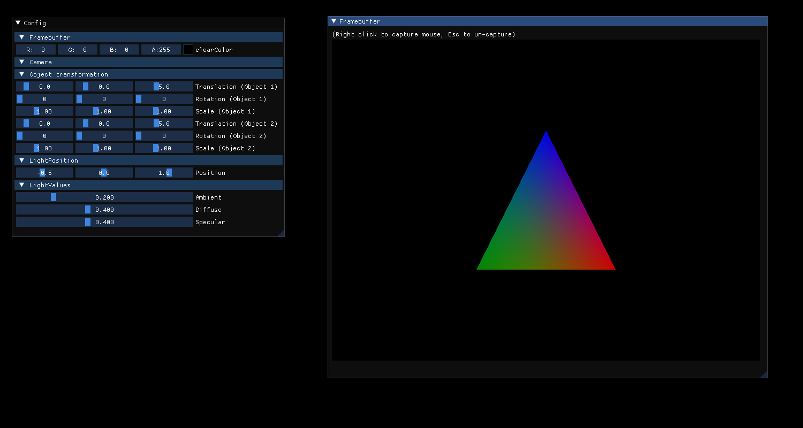
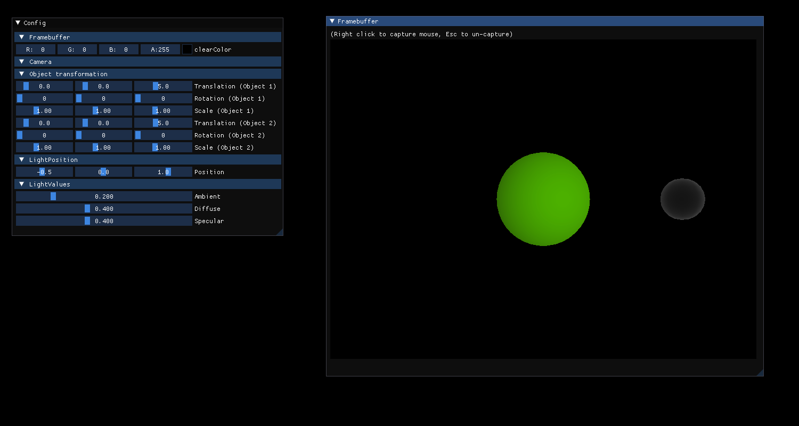
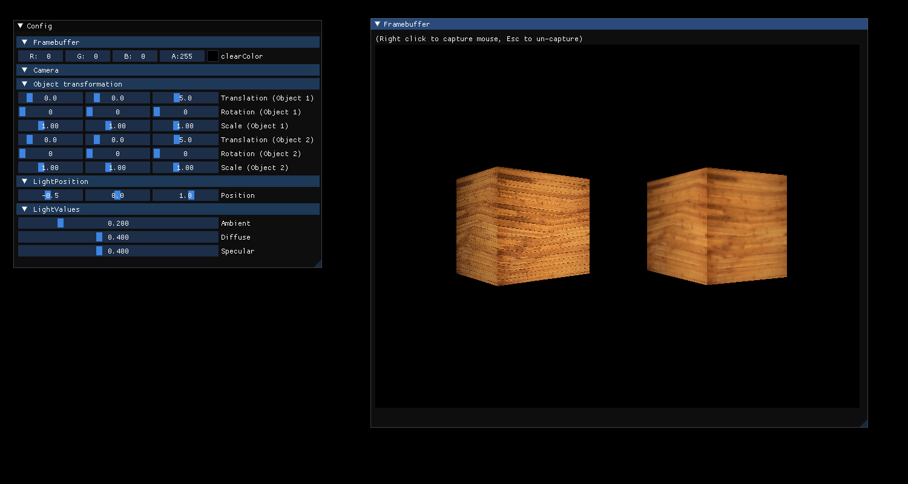
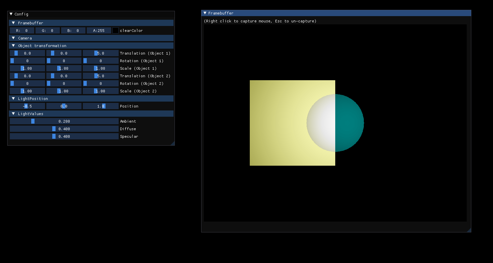

# Project Rasterizer
<hr />

**Authors : Vincent Devine, Omaya Lise and Kristian GOUPIL**

For ISART Digital

<hr /><br />

## **Project description :**
Our goal was to do the rasterizing process made in OpenGl without using its functions. To achieve this we had to understand how to draw our shapes (from local space to the screen) using matrix. We also had to oversee other aspect such as the gestion of lights, texture or perspective.

## To build and run the project : 
Enter the command "make && ./Rasterizer" in the terminal.

<br /><hr /><br />


## **Commands :**
- Right click on the right window : Access camera controls 
    - W/S : Move forward/backward
    - A/D : Move left/right
    - Shift/Spacebar: Move up/down
    - Mouse : Look in a direction
- F1 : Show Wireframe
- F2 : Switch to the colored triangle scene (default scene)
- F3 : Switch to the buffer scene
- F4 : Switch to the lights scene 
- F5 : Switch to the opacity scene 
- F6 : Switch to the projection scene
- F7 : Switch to the texture scene

- Values (shape position, light intensity, etc) can also be modified on the left panel
</ul><br />




On the lights scene, a small sphere materialize the light position (which can be modified on the panel on the left).<br />
##  **Hardest part of the project:**

As we had to build everything from scratch, we had to do a lot of personal research. <br />At times it was hard to find or select information on some subject.
<br />

##  **Features to add:**
 
- Bilinear interpolation to solve texture bug
- Anti-aliasing
<br />
<hr />


On the texture scene, we can see the same texture (the second time with a low resolution) on two cubes.
## **Architecture**
```sh.
├── externals
├── imgui.ini
├── include
│   ├── App.hpp
│   ├── Camera.hpp
│   ├── Framebuffer.hpp
│   ├── Light.hpp
│   ├── myMath.hpp
│   ├── Object.hpp
│   ├── Renderer.hpp
│   ├── Scene.hpp
│   └── Texture.hpp
├── Makefile
├── rasterizer
├── Rasterizer
├── README.md
├── src
│   ├── App.cpp
│   ├── Camera.cpp
│   ├── Framebuffer.cpp
│   ├── Light.cpp
│   ├── main.cpp
│   ├── myMath.cpp
│   ├── Object.cpp
│   ├── Renderer.cpp
│   ├── Scene.cpp
│   ├── Texture.cpp
├── test
│   └── testMath.cpp
├── texture
│   ├── chessboard.bmp
│   ├── lowRez.bmp
│   └── textWood.bmp
├── Screenshots
│   ├── DoubleTriangle.png
│   ├── Lights.png
│   ├── Opacity.png
|   ├── RotatingCube.png
│   ├── Texture.png
│   └── TriangleColored.png
└── third_party
``` 

Code editor : Visual Studio Code
<br />
System : Linux


